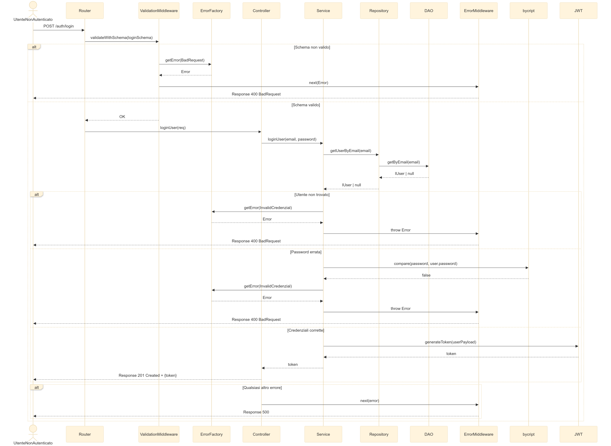

# Acqua Nav

Il presente progetto, sviluppato per l’esame di **Programmazione Avanzata (A.A. 2024/2025)** presso l'Università Politecnica delle Marche, realizza un sistema back-end in **TypeScript** per la gestione dei **Navigation Plan** per droni marini autonomi.

Il sistema implementa:

- Autenticazione e autorizzazione basata su ruoli (User, Operator, Admin) mediante **JWT (RS256)**.
- Gestione e validazione delle richieste di **Navigation Plan** (credito, date, percorsi e aree vietate).
- Gestione dinamica delle **Aree Vietate** tramite bounding box.
- Esportazione dei dati in formato **JSON** e **PDF**.
- Test automatici su middleware e API con **Jest**.

Il progetto utilizza **Node.js**, **Express**, **TypeScript**, **MongoDB** e **Mongoose**.

Indice 

- [Descrizione](#descrizione)
- [Analisi](#analisi)
  - [Requisiti funzionali](#requisiti-funzionali)
  - [Requisiti non funzionali](#requisiti-non-funzionali)
   - [Diagrammi dei Casi d'Uso](#diagrammi-dei-casi-duso)
      - [Attori](#attori)
      - [Diagramma senza autenticazione ](#diagramma-senza-autenticazione)
      - [Diagrammi con autenticazione ](#diagramma-con-autenticazione)
  - [Diagrammi delle sequenze ](#diagrammi-dei-casi-duso)
      - [Login ](#login)
      - [Visualizzazione navigationPlans ](#visualizzazione-NavigationPlans)
      - [Creazione navigationPlans ](#creazione-NavigationPlan)
      - [Cancellazione navigationPlans ](#cancellazione-navigationPlans)
      - [Approvazione NavigationPlans ](#approvazione-navigationPlans)
      - [Rifiuto NavigationPlans ](#rifiuto-NnvigationPlans)
      - [Visualizzazione Aree Vietate ](#visualizzazione-aree-Vietate)
      - [Creazione Aree Vieatata ](#creazione-aree-vieatata)
      - [Modifica Aree Vieatata ](#modifica-aree-vieatata)
      - [Eliminazione Aree Vieatata ](#eliminazione-Aree-Vieatata)
      - [Ricarica token user](#ricarica-token-user)
- [Progettazione Database](#progettazione-database)
- [Pattern Utilizzati](#pattern-utilizzati)
- [Struttura Progetto ](#pattern-utilizzati)
- [Rotte](#pattern-utilizzati)
- [Istruzioni di configurazione e avvio ](#istruzioni-di-configurazione-e-avvio)

---

## Descrizione

Il sistema backend consente la gestione dei **Navigation Plan** per droni marini autonomi.  
Un **Navigation Plan** rappresenta una richiesta creata da un utente autenticato con ruolo `User`, tramite la quale viene definito il percorso che il drone dovrà seguire in mare.

Ogni **Navigation Plan** include:

- L’identificativo dell’imbarcazione (codice alfanumerico di 10 caratteri).
- La data e l’orario di inizio e fine navigazione.
- Una sequenza ordinata di **waypoint**, ognuno dei quali definisce una coppia di coordinate geografiche (latitudine e longitudine).

> Il percorso deve obbligatoriamente essere chiuso: il primo e l’ultimo waypoint devono coincidere, garantendo il ritorno del drone al punto di partenza.

Al momento dell’invio di un nuovo **Navigation Plan**, il sistema esegue automaticamente una serie di verifiche:

- **Verifica del credito token disponibile**: l’utente deve possedere almeno **5 token** per poter inviare la richiesta (ogni richiesta valida consuma 5 token).
- **Verifica temporale**: la data di partenza deve essere programmata con almeno **48 ore di anticipo** rispetto alla data e ora attuale.
- **Validazione del percorso**: viene verificato che il percorso non attraversi alcuna delle **Aree Vietate** definite nel sistema.

Se tutte le condizioni risultano soddisfatte, il **Navigation Plan** viene registrato con stato `pending`, in attesa di revisione da parte di un Operatore.  
In caso contrario, la richiesta viene immediatamente rifiutata.

<p align="center">
  
</p>
<p align="center"><em>Esempio di piano di navigazione</em></p>

Le aree vietate rappresentano porzioni di mare interdette alla navigazione, per motivi di sicurezza o regolamentazioni. Ogni area vietata viene definita come un rettangolo geografico tramite due coppie di coordinate che rappresentano gli estremi della bounding box. Queste aree sono costantemente consultabili pubblicamente da chiunque, senza necessità di autenticazione, in modo che gli utenti possano pianificare i propri piani di navigazione evitando queste zone.

<p align="center">
  
</p>
<p align="center"><em>Esempio Area vietata </em></p>

I tipi di utenti previsti nel sistema sono:
### Ruoli e Permessi

Il sistema definisce quattro ruoli principali, ciascuno con specifiche funzionalità e livelli di accesso:

| Ruolo      | Autenticazione         | Funzionalità |
|------------|-------------------------|--------------|
| **Guest**  | Non autenticato         | - Consultazione pubblica dell’elenco delle **Aree Vietate** |
| **User**   | JWT con ruolo `User`    | - Creazione di nuovi **Navigation Plan**<br>- Visualizzazione e filtraggio delle proprie richieste<br>- Cancellazione dei **Navigation Plan** in stato `pending`<br>- Esportazione delle proprie richieste in formato JSON e PDF<br> |
| **Operator** | JWT con ruolo `Operator` | - Gestione completa delle **Aree Vietate** (creazione, modifica, eliminazione)<br>- Visualizzazione di tutte le richieste degli utenti<br>- Approvazione o rifiuto dei **Navigation Plan** in stato `pending`, con eventuale motivazione di rifiuto |
| **Admin**  | JWT con ruolo `Admin`   | - Gestione e ricarica dei crediti token degli utenti |

> **Nota:**  
> Tutti gli utenti autenticati (User, Operator, Admin), oltre ai guest non autenticati, possono sempre consultare liberamente l’elenco aggiornato delle **Aree Vietate**.

Il sistema garantisce la sicurezza  dei dati attraverso un meccanismo di autenticazione e autorizzazione basato su **token JWT firmati con algoritmo RS256**, e gestisce la persistenza dei dati tramite **MongoDB** con l’ausilio di **Mongoose**.


## Analisi  
A partire dall’analisi della descrizione , sono stati individuati i principali requisiti del sistema e i relativi casi d’uso. 

I requisiti sono suddivisi in:
1) Requisiti Funzionali (RF): definiscono le funzionalità richieste,
2) Requisiti Non Funzionali (RNF): indicano vincoli generali

### Requisiti funzionali 

| Codice | Nome | Descrizione |
|--------|------|-------------|
| RF1 | Creazione Navigation Plan | Permette agli utenti autenticati (`User`) di creare nuovi **Navigation Plan**, con verifica automatica di credito disponibile, vincolo temporale e validazione del percorso rispetto alle **Aree Vietate** |
| RF2 | Visualizzazione Navigation Plan utente | Consente agli utenti `User` di visualizzare l’elenco dei propri **Navigation Plan** |
| RF3 | Visualizzazione completa Navigation Plan | Permette agli operatori `Operator` di visualizzare l’elenco completo di tutti i **Navigation Plan** creati da qualsiasi utente |
| RF4 | Filtraggio Navigation Plan | Permette:<br>- Agli utenti `User` di filtrare i propri **Navigation Plan** per **stato** e **intervallo temporale** (data di partenza)<br>- Agli operatori `Operator` di filtrare l’elenco completo per **stato** |
| RF5 | Cancellazione Navigation Plan utente | Consente agli utenti `User` di annullare i propri **Navigation Plan** in stato `pending` |
| RF6 | Gestione stato Navigation Plan | Permette agli operatori `Operator` di approvare o rifiutare i **Navigation Plan** in stato `pending`, specificando eventuali motivazioni di rifiuto |
| RF7 | Gestione Aree Vietate (CRUD) | Permette agli operatori `Operator` di creare, modificare, visualizzare ed eliminare le **Aree Vietate** definite tramite bounding box |
| RF8 | Consultazione pubblica Aree Vietate | Consente a qualsiasi utente (autenticato o meno) di consultare l’elenco aggiornato delle **Aree Vietate** |
| RF9 | Esportazione dati | Permette agli utenti `User` di esportare i propri **Navigation Plan** in formato **JSON** e **PDF** |
| RF10 | Autenticazione e autorizzazione | Gestisce l’accesso al sistema tramite autenticazione JWT e controllo dei ruoli (`User`, `Operator`, `Admin`) |
| RF11 | Gestione crediti utenti | Permette all’amministratore `Admin` di ricaricare il credito (token) degli utenti |


### Requisiti Non Funzionali (RNF)

| Codice | Categoria         | Descrizione |
|--------|--------------------|-------------|
| RNF1 | Linguaggio di sviluppo | L’intera applicazione è sviluppata in **TypeScript**, garantendo tipizzazione forte e maggiore robustezza del codice. |
| RNF2 | Persistenza dati  | I dati sono gestiti tramite database **MongoDB**, con accesso e modellazione degli schemi tramite ORM **Mongoose**. |
| RNF3 | Manutenibilità    | L’applicazione implementa diversi **Design Pattern** (DAO, Repository, Factory, Singleton, MVC) per garantire codice pulito, facilmente manutenibile e testabile. |
| RNF5 | Documentazione    | Il codice è completamente documentato e commentato per agevolare lo sviluppo collaborativo e la futura manutenzione. |
| RNF6 | Portabilità       | Il sistema è completamente containerizzato tramite **Docker**, facilitando il deploy su qualsiasi ambiente compatibile. |
| RNF7 | Performance       | Le richieste sono gestite in modalità asincrona ed efficiente grazie all’utilizzo di **Node.js** ed **Express**. |

### Diagrammi dei  casi d'uso

Il sistema per la gestione dei piani di navigazione dei droni marini autonomi coinvolge diversi attori che interagiscono con il sistema per svolgere specifiche funzionalità in base al proprio ruolo. Il diagramma dei casi d’uso rappresenta graficamente queste interazioni, illustrando le funzionalità principali a disposizione di ciascun attore.

### Attori
<p align="center">
  
</p>
<p align="center"><em>Attori</em></p>

### Diagramma senza autenticazione
Il sistema espone alcune rotte accessibili senza autenticazione e una funzionalità di login che consente agli utenti di ottenere le credenziali per accedere ai casi d’uso protetti. In particolare, l’attore Guest può interagire solo con le rotte pubbliche, senza necessità di autenticazione, mentre gli attori User, Operator e Admin devono effettuare il login per ottenere il token JWT che consente loro di accedere alle funzionalità specifiche previste dal proprio ruolo. Il diagramma dei casi d’uso rappresenta queste interazioni distinguendo chiaramente le operazioni pubbliche disponibili per tutti gli utenti e il processo di autenticazione necessario per accedere ai casi d’uso riservati
<p align="center">
  
</p>
<p align="center"><em></em></p>

### Diagramma con autenticazione
Dopo aver effettuato il login ed ottenuto un token JWT valido, ogni utente autenticato può accedere esclusivamente alle funzionalità previste per il proprio ruolo. Il sistema applica un meccanismo di autorizzazione basato sui ruoli contenuti nel token: l’attore User può accedere ai casi d’uso relativi alla gestione delle proprie richieste di navigazione; l’attore Operator può gestire le aree vietate e valuta le richieste degli user aggiornando lo status della richiesta; l’attore Admin ha accesso alle funzionalità di gestione del credito degli utenti.
<p align="center">
  
</p>
<p align="center"><em></em></p>

## Diagramma delle sequenze 
Il diagramma di sequenza è uno strumento UML (Unified Modeling Language) che serve per rappresentare il flusso temporale delle interazioni tra i vari componenti di un sistema.Per ogni rotta API è stato realizzato un diagramma di sequenza che descrive il flusso delle interazioni tra client e backend. I diagrammi rappresentano l’ordine delle richieste e risposte, indicando le operazioni principali e i messaggi scambiati, al fine di documentare in modo chiaro la logica applicativa e semplificare eventuali sviluppi o manutenzioni future.
### Login
<p align="center">
  
</p>
<p align="center"><em></em></p>

### Visualizzazione NavigationPlans
<p align="center">
  
</p>
<p align="center"><em></em></p>

### Creazione NavigationPlans
<p align="center">
  
</p>
<p align="center"><em></em></p>

### Cancellazione NavigationPlans
<p align="center">
  
</p>
<p align="center"><em></em></p>

### Approvazione NavigationPlans
<p align="center">
  
</p>
<p align="center"><em></em></p>

### Rifiuto NavigationPlans
<p align="center">
  
</p>
<p align="center"><em></em></p>

### Visualizzazione Aree Vietate
<p align="center">
  
</p>
<p align="center"><em></em></p>

### Creazione Aree Vieatata
<p align="center">
  
</p>
<p align="center"><em></em></p>

### Modifica Aree Vieatata
<p align="center">
  
</p>
<p align="center"><em></em></p>

### Eliminazione Aree Vieatata
<p align="center">
  
</p>
<p align="center"><em></em></p>

### Ricarica token user
<p align="center">
  
</p>
<p align="center"><em></em></p>

## Progettazione Database
Il database è strutturato su 3 collezioni principali:
1) users
2) restricted_areas
3) navigation_plans
### Collezione users
Rappresenta gli utenti del sistema.I documenti dentro la collezione hanno uno schema come il seguente.
| Campo      | Tipo     | Descrizione                                         |
| ---------- | -------- | --------------------------------------------------- |
| `_id`      | ObjectId | Identificativo univoco                              |
| `email`    | string   | Email dell'utente (univoca, obbligatoria)           |
| `password` | string   | Password hash (obbligatoria)                        |
| `role`     | string   | Ruolo dell'utente (`admin` \| `user` \| `operator`) |
| `tokens`   | number   | Crediti disponibili (default: 0, minimo: 0)         |
### Collezione restricted_areas
Rappresentano le aree geografiche vietate. I documenti dentro la collezione hanno uno schema come il seguente
| Campo             | Tipo     | Descrizione                                          |
| ----------------- | -------- | ---------------------------------------------------- |
| `_id`             | ObjectId | Identificativo univoco                               |
| `topLeft`         | Embedded document  | Coordinata dell'angolo superiore sinistro            |
| `topLeft.lat`     | number   | Latitudine angolo superiore sinistro (obbligatorio)  |
| `topLeft.lon`     | number   | Longitudine angolo superiore sinistro (obbligatorio) |
| `bottomRight`     | Embedded document  | Coordinata dell'angolo inferiore destro              |
| `bottomRight.lat` | number   | Latitudine angolo inferiore destro (obbligatorio)    |
| `bottomRight.lon` | number   | Longitudine angolo inferiore destro (obbligatorio)   |

### Collezione navigation_plans
Rappresentano i piani di navigazione richiesti dagli utenti.I documenti dentro la collezione hanno uno schema come il seguente
| Campo             | Tipo             | Descrizione                                                |
| ----------------- | ---------------- | ---------------------------------------------------------- |
| `_id`             | ObjectId         | Identificativo univoco                                     |
| `userId`          | string           | Riferimento a `users._id` (obbligatorio)                   |
| `boatId`          | string           | Codice barca (obbligatorio, 10 caratteri esatti)           |
| `waypoints`       | Array di embedded document  | Elenco di waypoint (coordinate geografiche)                |
| `waypoints[].lon` | number           | Longitudine del waypoint                                   |
| `waypoints[].lat` | number           | Latitudine del waypoint                                    |
| `startDate`       | Date             | Data di partenza (obbligatoria)                            |
| `endDate`         | Date             | Data di fine (obbligatoria)                                |
| `status`          | string           | Stato del piano (`pending` \| `approved` \| `rejected`)    |
| `rejectionReason` | string           | Motivo del rifiuto (obbligatorio se `status` = `rejected`) |

## Pattern Utilizzati

In questa parte parleremo dei pattern utilizzati all'interno del progetto

### Model - Controller - Service
Il progetto adotta il pattern architetturale **Model - Controller - Service**, un approccio largamente utilizzato nello sviluppo di applicazioni backend modulari, scalabili e facilmente manutenibili. A differenza del pattern tradizionale **MVC (Model-View-Controller)**, in questo contesto backend la componente "View" non è presente, in quanto non vi è alcuna gestione di interfacce grafiche: l’attenzione è interamente focalizzata sull’organizzazione della logica applicativa e sull’accesso ai dati.


1) Model : rappresenta la struttura dati dell’applicazione e gestisce l’interazione con il database. In questo progetto, i modelli sono definiti tramite Mongoose, un ORM per MongoDB che consente di modellare i dati. Questo approccio permette di astrarre completamente le operazioni sul database sottostante, garantendo codice più leggibile, mantenibile e meno soggetto a errori legati alla gestione diretta delle query. 

  ```typescript
  const UserSchema = new Schema<IUser>({
    email: {
      type: String,
      required: true,
      unique: true,
      trim: true
    },
    password: {
      type: String,
      required: true
    },
    role: {
      type: String,
      enum: Object.values(UserRole),
      required: true,
      default: UserRole.USER
    },
    tokens: {
      type: Number,
      default: 0,
      min: 0,
      required: false 
    }
  });
  ```

  > **Nota:**  
> Il presente schema definisce il modello dati User utilizzato per la persistenza su MongoDB attraverso Mongoose.

2) Controller Nel progetto, i Controller rappresentano il punto di ingresso principale per le richieste HTTP ricevute dall’applicazione backend. La loro funzione è quella di ricevere le richieste provenienti dal client, estrarre e validare i parametri richiesti (eventualmente delegando parte della validazione ai middleware), e coordinare il flusso di esecuzione delle operazioni. Una volta ricevuti e validati i dati, i Controller inoltrano la richiesta al corrispondente Service che si occuperà della logica applicativa.Oltre a gestire il flusso delle richieste, i Controller sono responsabili della preparazione e della formattazione delle risposte da inviare al client, restituendo gli eventuali dati, messaggi di errore o codici di stato HTTP adeguati. I Controller non contengono logica applicativa complessa, ma fungono esclusivamente da interfaccia di comunicazione tra il client e la logica di business, garantendo così una netta separazione delle responsabilità e facilitando la manutenibilità e la chiarezza del codice.

Esempio pratico di Controller:

```typescript
export class NavigationPlanController {

  constructor(private navigationPlanService: NavigationPlanService) {}

  /**
   * Crea un nuovo Navigation Plan per l'utente autenticato.
   *
   * @route POST /api/navigation-plans
   * @param req Contiene il corpo della richiesta 
   * @param res Risposta HTTP con il piano creato o errore.
   * @param next Middleware per la gestione centralizzata degli errori.
   */
  createNavigationPlan = async (req: Request, res: Response, next: NextFunction) => {
    try {
      const userId: string = req.user.id;
      const created: INavigationPlan = await this.navigationPlanService.createNavigationPlan(req.body, userId);
      res.status(StatusCodes.CREATED).json(created);
    } catch (error) {
      console.error(error);
      next(error);
    }
  };
}
```
3) Service = Il Service contiene la logica di business dell’applicazione. Qui vengono implementate le operazioni principali del sistema come la validazione complessa dei piani di navigazione, la verifica delle aree vietate, la gestione del credito token. Il Service interagisce con i modelli tramite apposite classi Repository, centralizzando così l’accesso ai dati e garantendo un’ulteriore separazione tra logica applicativa e persistenza dei dati. 
Esempio pratico di Service:

```typescript
async createNavigationPlan(plan: INavigationPlan, userId: string) {
    const errorFactory = new ErrorFactory();

    // Recupera l'utente dal database
    const user = await this.userRepository.getUserById(userId);
    if (!user) {
        throw errorFactory.getError(ErrEnum.UserNotFound);
    }

    // Verifica se l'utente ha credito sufficiente
    if (!user.tokens || user.tokens < TokenCosts.CREATE_PLAN) {
        throw errorFactory.getError(ErrEnum.InsufficientTokens);
    }

    // Recupera tutte le aree vietate
    const restrictedAreas = await this.restricted_area.listAllAreas();
    const route = createLineStringFromCoords(plan.waypoints);

    // Verifica se il percorso interseca le aree vietate
    for (const area of restrictedAreas) {
        const boundingBox = createBoundingBoxPolygon(area.topLeft, area.bottomRight);
        if (!isRouteOutsideBox(route, boundingBox)) {
            throw errorFactory.getError(ErrEnum.RouteRestricted);
        }
    }

    // Aggiorna il credito token dell’utente
    await this.userRepository.updateUser(userId, {
        tokens: user.tokens - TokenCosts.CREATE_PLAN
    });

    // Salva il Navigation Plan nel database
    plan.userId = userId;
    await this.navigationPlanRepository.createPlan(plan);

    return plan;
}
```
  > **Nota:**  
> In questo esempio il Service esegue tutti i controlli di business richiesti prima di creare un nuovo Navigation Plan: Verifica esistenza utente,
Controllo credito token,validazione del percorso rispetto alle Aree Vietate,
aggiornamento del saldo token, creazione e salvataggio del piano 

### DAO (Data Access Object)

Nel presente progetto il pattern **DAO (Data Access Object)** è ampiamente utilizzato per disaccoppiare la logica applicativa dall’accesso diretto al database.  
In particolare, il DAO viene introdotto come **layer intermedio** tra il livello di persistenza fisica gestito da **Mongoose** e il livello superiore rappresentato dai **Repository**.

#### Funzione del DAO nel progetto

- I **DAO** astraggono completamente l’interazione diretta con **Mongoose**, isolando la logica di accesso ai dati dalle specificità del database.
- I **Repository** lavorano esclusivamente con i DAO e non interagiscono mai direttamente con Mongoose.
- I **Service** a loro volta comunicano solo con i Repository, mantenendo così una separazione completa tra logica applicativa e persistenza.


#### Interfaccia generica DAO utilizzata nel progetto

Nel progetto viene utilizzata un’interfaccia generica `IDao<T>` che definisce i metodi asincroni CRUD per ogni entità:

```typescript
/**
 * Interfaccia generica per i DAO (Data Access Object)
 */
export interface IDao<T> {
  /**
   * Crea un nuovo elemento.
   * @param item Oggetto da creare
   * @returns L'oggetto creato
   */
  create(item: T): Promise<T>;

  /**
   * Restituisce un elemento dato il suo ID.
   * @param id Identificatore univoco
   * @returns L'oggetto corrispondente, o null se non trovato
   */
  getbyID(id: string): Promise<T | null>;

  /**
   * Restituisce tutti gli elementi.
   * @returns Array di oggetti
   */
  getAll(): Promise<T[]>;

  /**
   * Aggiorna un elemento esistente.
   * @param id Identificatore dell’elemento da aggiornare
   * @param item Nuovi dati aggiornati
   * @returns L'oggetto aggiornato, o null se non trovato
   */
  update(id: string, item: T): Promise<T>;

  /**
   * Elimina un elemento dato il suo ID.
   * @param id Identificatore univoco dell’elemento da eliminare
   * @returns void
   */
  delete(id: string): Promise<void>;
}
```
### Repository
Nel progetto viene adottato anche il pattern **Repository**, che introduce un ulteriore livello di astrazione logica sopra il livello dei **DAO**. Se il DAO fornisce un’interfaccia generica per l’accesso ai dati persistenti, il **Repository** lavora a un livello più vicino al dominio applicativo e alla logica di business.In questa architettura, il Repository funge da **strato intermedio tra il DAO e il Service**. Ogni Repository utilizza internamente un DAO specifico per l’entità di riferimento e fornisce al Service metodi più espressivi e orientati al dominio, semplificando ulteriormente il lavoro dei Service stessi.

### Singleton

Il **Singleton** è un pattern creazionale che assicura l’esistenza di una singola istanza di una classe, fornendo al contempo un punto di accesso globale e controllato ad essa. Questo approccio è particolarmente indicato per la gestione di **risorse condivise** e centralizzate, come ad esempio connessioni al database. Nel presente progetto, il pattern Singleton viene adottato per garantire che alcune componenti fondamentali, come la **connessione al database MongoDB**, vengano istanziate una sola volta durante l’intero ciclo di vita del backend. In questo modo si evita la creazione di connessioni multiple e ridondanti;

#### Funzionamento

Il Singleton impedisce la creazione diretta di istanze grazie al **costruttore privato**. L’unica modalità per ottenere l’istanza è tramite un metodo statico, ad esempio `getInstance()`, che:

- crea l’istanza al primo accesso.
- restituisce sempre la stessa istanza per tutte le richieste successive.

#### Esempio di implementazione nel progetto:

```typescript
class MongoDB {
  private static instance: MongoDB;
  private constructor() {}

  public static async getInstance(): Promise<MongoDB> {
    if (!MongoDB.instance) {
      const MONGO_URI = `mongodb://${process.env.MONGO_INITDB_ROOT_USERNAME}:${process.env.MONGO_INITDB_ROOT_PASSWORD}@${process.env.MONGO_HOST}:${process.env.MONGO_PORT}/mydatabase?authSource=admin`;
      await mongoose.connect(MONGO_URI, { dbName: process.env.MONGO_DB_NAME });
      console.log("Connessione al DB effettuata");
      MongoDB.instance = new MongoDB();
    }
    return MongoDB.instance;
  }
}

export default MongoDB;
```
### Chain of Responsibility

Il **Chain of Responsibility (CoR)** è un design pattern comportamentale che consente di inviare una richiesta lungo una catena di oggetti handler. Ogni handler nella catena decide se gestire la richiesta o passarla al successivo, disaccoppiando così il mittente dai possibili destinatari.
Nel progetto, questo pattern è stato applicato attraverso l’uso strutturato di **middleware** nel framework **Express.js**, sfruttando l’analogia naturale tra la catena di handler del CoR e la sequenza di middleware tipica delle applicazioni web.

#### Utilizzo nel progetto

Nel backend sviluppato, il pattern Chain of Responsibility viene utilizzato per:

- **Autenticazione** = Verifica che l’utente sia autenticato tramite un token JWT se no manda degli errori.

```typescript
export const Auth = [
    AuthMiddleware.checkAuthHeader, 
    AuthMiddleware.checkToken, 
    AuthMiddleware.verifyAndAuthenticate
];
```
- **Autorizzazione**: Validare il ruolo (`User`, `Operator`, `Admin`) prima di consentire l’accesso alla risorsa protetta.
```typescript
export const authorizeRole = (...allowedRoles:UserRole[]) => {

  return (req: Request, res: Response, next: NextFunction) => {
    const user = req.user; 
    if (!user || !allowedRoles.includes(user.role)) {
      const errorFactory = new ErrorFactory();
      return next(errorFactory.getError(ErrEnum.Unauthorized));
    }
    next(); 
  };
  
};
```
-  **Validazione dei dati** =
Prima che una richiesta venga gestita dalla logica applicativa, viene eseguita una **validazione preventiva dei dati in ingresso**, per garantire che tutti i parametri richiesti siano presenti e correttamente formattati.
Nel progetto la validazione dei dati in ingresso viene gestita in modo centralizzato e dichiarativo attraverso l’utilizzo della libreria **Zod**, un potente schema validator per TypeScript. Ogni richiesta HTTP (sia body, query string che parametri di route) viene verificata prima di essere inoltrata alla logica applicativa. Per ciascun tipo di richiesta viene definito uno **schema Zod** che descrive in maniera formale i vincoli attesi: tipi di dato, formati, lunghezze, range numerici e vincoli logici. Durante l’esecuzione, i middleware applicano automaticamente lo schema corrispondente alla richiesta. Se i dati ricevuti non rispettano i vincoli definiti, Zod blocca immediatamente la richiesta e restituisce un errore dettagliato, evitando che dati non validi raggiungano i livelli successivi della business logic. In questo modo si garantisce la robustezza e la sicurezza dell’intera applicazione, riducendo drasticamente la necessità di ulteriori controlli nei controller e nei service.
```typescript
export const validateWithSchema = (schema: ZodSchema, source: ValidateReq) => {
  return (req: Request, res: Response, next: NextFunction) => {
    let dataToValidate = req[source]; // estrae i dati dalla sorgente specificata

    // Caso speciale per validare `params` con schema su singolo parametro (es. id)
    if (source === 'params') {
      const paramKeys = Object.keys(req.params);
      
      // Se c’è un solo parametro (es. { id: '...' }), estrai direttamente il valore
      if (paramKeys.length === 1) {
        dataToValidate = req.params[paramKeys[0]];
      }
    }

    // Esegue la validazione tramite Zod
    const parsed = schema.safeParse(dataToValidate);

    if (!parsed.success) {
      // In caso di errore, mappa i messaggi di validazione per eventuale log
      const errors = parsed.error.errors.map(err => ({
        field: err.path.join('.'),
        message: err.message,
      }));

      console.log('Validation failed:', errors);

      // Inoltra errore generico tramite factory centralizzata
      const errorFactory = new ErrorFactory();
      return next(errorFactory.getError(ErrEnum.BadRequest));
    }

    // (Opzionale) Se vuoi salvare i dati validati su req per uso successivo:
    // req.validatedData = parsed.data;

    next();
  };
};
```

- **Gestione centralizzata degli errori**: intercettare e gestire eccezioni attraverso un middleware di error handling unificato.
```typescript
const errorHandler = (err: any, req: Request, res: Response, next: NextFunction) => {
   const error= err.getErrorResponse()
   res.status(error.status).json({
    error: error.msg,
  });
};

```
In pratica, ogni richiesta HTTP attraversa una vera e propria **catena di handler** (autenticazione → autorizzazione → validazione → business logic → gestione errori), pienamente in linea con il pattern **Chain of Responsibility**.


### Factory

Il **Factory** è un design pattern creazionale che centralizza la logica di creazione degli oggetti, disaccoppiando l’istanziazione dal resto dell’applicazione.   Nel progetto, questo pattern è stato adottato per gestire in modo modulare e standardizzato la creazione delle risposte di errore.Per la gestione degli errori, è stata definita un’interfaccia generica `ErrorResponse`:

```typescript
interface ErrorResponse {
  getErrorResponse(): { status: number; msg: string };
}
```
Ogni tipo di errore applicativo implementa questa interfaccia definendo un proprio messaggio di errore e relativo codice HTTP. Ad esempio:

```typescript
export class MissingAuthHeaderError implements ErrorResponse {
  getErrorResponse(): { status: number; msg: string } {
    return {
      status: StatusCodes.BAD_REQUEST,
      msg: ErrorMessages.NO_AUTH_HEADER,
    };
  }
}
```
Tutti i messaggi testuali vengono mantenuti centralizzati all'interno di una mappa ErrorMessages:
```typescript
export const ErrorMessages = {
  NO_AUTH_HEADER: "Bad Request - No authorization header",
  MISSING_TOKEN: "Bad Request - Missing JWT Token",
  INVALID_TOKEN: "Forbidden - Invalid JWT Token",
  USER_NOT_FOUND: "ERROR - User not found",
  INSUFFICIENT_TOKENS: "ERROR - User does not have enough tokens",
  PLAN_NOT_FOUND: "ERROR - Navigation plan not found",
  INTERNAL_SERVER_ERROR: "ERROR - Internal server error",
  // ... (altri messaggi)
};

```
  > **Vantaggi:**  
> Grazie a questa mappa centralizzata è possibile modificare i messaggi di errore in modo rapido e uniforme, senza dover intervenire nel codice delle singole classi o nella logica applicativa. L'intero sistema diventa così più manutenibile, flessibile e localizzabile. 

Per centralizzare la creazione degli errori, è stata implementata la ErrorFactory, responsabile di restituire dinamicamente l’istanza del tipo di errore corretto in base a un enum ErrEnum:
```typescript
export enum ErrEnum {
  MissingAuthHeader,
  MissingToken,
  InvalidToken,
  UserNotFound,
  InsufficientTokens,
  InternalServerError,
  // ... altri tipi di errore
}
```
La factory seleziona il tipo di errore tramite un semplice switch:
```typescript
export enum ErrEnum {
  export class ErrorFactory {
  public getError(type: ErrEnum): ErrorResponse {
    let retval: ErrorResponse;

    switch (type) {
      case ErrEnum.MissingAuthHeader:
        retval = new MissingAuthHeaderError();
        break;
      case ErrEnum.MissingToken:
        retval = new MissingTokenError();
        break;
      case ErrEnum.UserNotFound:
        retval = new UserNotFoundError();
        break;
        ... altri case
    }

    return retval;
  }

  }
}
```
## Rotte
| HTTP     | Endpoint                            | Descrizione                                                                                                                                                                                                                                                                                                                   | Autenticazione | Ruolo richiesto |
| ---------- | -------------------------------- | ----------------------------------------------------------------------------------------------------------------------------------------------------------------------------------------------------------------------------------------------------------------------------------------------------------------------------- | -------------- | --------------- |
| **PATCH**    | `/users/:userId/token`                     | Aggiorna i token dell'utente specificato                                                                                                                                                                                                                                                      | Sì             | ADMIN           |
| **GET**    | `/restricted-areas`              | Restituisce la lista completa delle aree vietate                                                                                                                                                                                                                                                                              | No             | Nessuno         |
| **POST**   | `/restricted-areas/`             | Crea una nuova area vietata                                                                                                                                                                                                                                                                                                   | Sì             | OPERATOR        |
| **DELETE** | `/restricted-areas/:areaId`          | Elimina un'area vietata esistente                                                                                                                                                                                                                                                                                             | Sì             | OPERATOR        |
| **PUT**    | `/restricted-areas/:areaId`          | Aggiorna i dati di un'area vietata esistente                                                                                                                                                                                                                                                                                  | Sì             | OPERATOR        |
| **GET**    | `/navigation-plans`              | Ottiene i piani di navigazione con filtri applicabili tramite il ruolo | Sì             | USER, OPERATOR  |
| **POST**   | `/navigation-plans`              | Crea un nuovo piano di navigazione                                                                                                                                                                                                                                                                                            | Sì             | USER            |
| **PATCH** | `/navigation-plans/:planId/cancelled`          | Modifica lo status di un Navigation plan in `cancelled`                                                                                                                                                                                                                                                                            | Sì             | USER            |
| **PATCH**  | `/navigation-plans/:planId/accepted` | Accetta un piano di navigazione in attesa                                                                                                                                                                                                                                                                                     | Sì             | OPERATOR        |
| **PATCH**  | `/navigation-plans/:planId/rejected` | Rifiuta un piano di navigazione (richiede motivazione)                                                                                                                                                                                                                                                                        | Sì             | OPERATOR        |
| **POST**   | `/auth/login`                    | Autentica l’utente e restituisce il token JWT                                                                                                                                                                                                                                                                                 | No             | Nessuno         |
<p>&nbsp;</p>

> **Nota sull’utilizzo degli ID**
>
>I campi identificativi (`userId`, `areaId`, `planId`, ecc.) devono essere  forniti come stringhe valide nel formato **MongoDB ObjectId**, cioè come una `stringa esadecimale di 24 caratteri (12 byte), ad esempio 507f1f77bcf86cd799439011`
Se l'ID fornito non rispetta il formato `ObjectId`, la richiesta verrà rifiutata con un errore 400  .
>
 > MongoDB genera automaticamente gli ObjectId al momento della creazione dei documenti, ma nelle richieste API in cui è necessario specificare un ID esistente (ad esempio per aggiornare, leggere o cancellare un documento), il client deve fornire un valore valido.

<p>&nbsp;</p>

> **Nota sull’utilizzo delle date**
>
>Le date devono essere fornite in formato **ISO 8601**, supportando i seguenti formati:
> - **solo data** → `YYYY-MM-DD` 
> - **data + orario** → `YYYY-MM-DDTHH:mm:ss`  
> - **data + orario + offset di fuso orario** → `YYYY-MM-DDTHH:mm:ssZ` oppure `YYYY-MM-DDTHH:mm:ss+02:00`
>
> **ESEMPI**
> - `2025-06-08`
> - `2025-06-08T12:00:00`
> - `2025-06-08T12:00:00Z`
> - `2025-06-08T12:00:00+02:00`

<p>&nbsp;</p>

> **Nota sull’utilizzo delle Coordinate**
>
> I waypoint devono essere forniti come oggetti con le seguenti proprietà numeriche:
> - lat (latitudine): valore compreso tra -90 e +90
> - lon (longitudine): valore compreso tra -180 e +180 
> Le coordinate sono espresse in gradi decimali (sistema WGS84), con la seguente struttura:
>```ts
>   {
 >     "lat": 43.5,
 >     "lon": 12.5
 >   }
>```

<p>&nbsp;</p>

> **Nota sugli errori**
>Tutte le richieste vengono validate prima dell’elaborazione.
Se i dati forniti non rispettano i formati richiesti o le regole di validazione, l’API restituisce una risposta di errore con:
Codice HTTP: 400 Bad Request
Formato della risposta di errore:
>```ts
>{
> "error":"Errore"
>}
>```

## POST /auth/login
### Parametri
| **Posizione**   | **Nome**            | **Tipo**               | **Descrizione**                                | **Opzionalità**         |
|-----------------|---------------------|------------------------|------------------------------------------------|-------------------------|
| Body            | *email*             | `string`               | Indirizzo email univoco associato all'utente   | No                      |
| Body            | *password*          | `string`               | Password associata all'utente                  | No                      |

La richiesta può essere svolta in questo modo:
```ts
POST http://localhost:3000/auth/login

{
  "email": "email@example.com",
  "password": "password"
}
```

La risposta attesa avrà questa forma:
```ts
200 OK
{
  "token": "token example"
}
```
## GET /restricted-areas
### Parametri

Nessuno 

La richiesta può essere svolta in questo modo:
```ts
POST http://localhost:3000/restricted-areas
```

La risposta attesa avrà questa forma:
```ts
200 OK

[
    {
        "topLeft": {
            "lat": 45,
            "lon": 10
        },
        "bottomRight": {
            "lat": 44,
            "lon": 11
        },
        "_id": "68503a2086eb42322104f82e",
    },
    {
        "topLeft": {
            "lat": 43.5,
            "lon": 12.5
        },
        "bottomRight": {
            "lat": 43,
            "lon": 13
        },
        "_id": "68503a2086eb42322104f82f",
    }
]
```

## POST /restricted-areas
### Parametri
| **Posizione**   | **Nome**            | **Tipo**               | **Descrizione**                                | **Opzionalità**         |
|-----------------|---------------------|------------------------|------------------------------------------------|-------------------------|
| Header            | *Authorization*             | `string`               |JWT token necessario per l'autenticazione  | No                    |
| Body            | *topLeft*             | `Waypoint`               | Coordinata dell'angolo superiore sinistro  | No                      |
| Body            | *bottomRight*          | `Waypoint`               |Coordinata dell'angolo inferiore destro                  | No                      |


La richiesta può essere svolta in questo modo:
```ts
POST http://localhost:3000/restricted-areas
Authorization: Bearer {{jwt_token}}

{
  "topLeft": {
            "lon": 43.5,
            "lat": 12.5
          },
  "bottomRight": {
      "lon": 43,
      "lat": 13
  }
}
```

La risposta attesa avrà questa forma:
```ts
201 OK
{
  "topLeft": {
            "lon": 43.5,
            "lat": 12.5
          },
  "bottomRight": {
      "lon": 43,
      "lat": 13
  }
  "_id": "6858064fcb0e48b0c5138a04",
}
```

## PUT /restricted-areas/:areaId
### Parametri
| **Posizione**   | **Nome**            | **Tipo**               | **Descrizione**                                | **Opzionalità**         |
|-----------------|---------------------|------------------------|------------------------------------------------|-------------------------|
| Header            | *Authorization*             | `string`               |JWT token necessario per l'autenticazione  | No                    |
| Params            | *areaId*             | `ObjectId`               | identificatvo dell'area vietata | No                      |               |
| Body            | *topLeft*             | `Waypoint`               | Coordinata dell'angolo superiore sinistro | No                 |               |
| Body            | *bottomRight*             | `Waypoint`               | Coordinata dell'angolo inferiore destro  | No                    |               |


La richiesta può essere svolta in questo modo:
```ts
PUT http://localhost:3000/restricted-areas/6858064fcb0e48b0c5138a04
Authorization: Bearer {{jwt_token}}

{
  "topLeft": {
            "lon": 2.5,
            "lat": 34.5
          },
  "bottomRight": {
            "lon": 22.5,
            "lat": 12.5
          },
}
```

La risposta attesa avrà questa forma:
```ts
200 OK
{

  "topLeft": {
            "lon": 2.5,
            "lat": 34.5
          },
  "bottomRight": {
            "lon": 22.5,
            "lat": 12.5
          },

  "_id": "6858064fcb0e48b0c5138a04",
}
```


## DELETE /restricted-areas/:areaId
### Parametri
| **Posizione**   | **Nome**            | **Tipo**               | **Descrizione**                                | **Opzionalità**         |
|-----------------|---------------------|------------------------|------------------------------------------------|-------------------------|
| Header            | *Authorization*             | `string`               |JWT token necessario per l'autenticazione  | No                    |
| Params            | *areaId*             | `ObjectId`               | identificatvo dell'area vietata | No                      |     No         |


La richiesta può essere svolta in questo modo:
```ts
DELETE http://localhost:3000/restricted-areas/6858064fcb0e48b0c5138a04
Authorization: Bearer {{jwt_token}}
```

La risposta attesa avrà questa forma:
```ts
200 OK
```

## PATCH /users/:userId/token
### Parametri
| **Posizione**   | **Nome**            | **Tipo**               | **Descrizione**                                | **Opzionalità**         |
|-----------------|---------------------|------------------------|------------------------------------------------|-------------------------|
| Header            | *Authorization*             | `string`               |JWT token necessario per l'autenticazione  | No                    |
| Params            | *userId*             | `ObjectId`               | identificatvo dell'area vietata | No                      |               |
| Body            | *tokens*             | `number`               | Numero di token da ricaricare all'utente | Si                     |               |


La richiesta può essere svolta in questo modo:
```ts
PATCH http://localhost:3000/users/68503a2086eb42322104f82a/token
Authorization: Bearer {{jwt_token}}
{
  "tokens": 3
}
```

La risposta attesa avrà questa forma:
```ts
200 OK
{
    "_id": "68503a2086eb42322104f82a",
    "email": "alepetty@gmail.com",
    "password": "$2b$10$EN2qlioImUgjWEU7ThcFg.rXG1NOHvpGXfrgw0xCyiHYWuVN7MD96",
    "role": "user",
    "tokens": 16,
}
```
## GET /navigation-plans User

### Parametri 
| **Posizione**   | **Nome**            | **Tipo**               | **Descrizione**                                | **Opzionalità**         |
|-----------------|---------------------|------------------------|------------------------------------------------|-------------------------|
| Header            | *Authorization*             | `string`               |JWT token necessario per l'autenticazione  | No                    |
| Query Params            | *from*             | `timestamp`               | Filtra i piani  con la `startDate`  successiva o uguale alla data specificata.  | Si                     |
| Query Params            | *to*          | `timestamp`               |        Filtra i piani  con la `startDate`  precedente o uguale alla data specificata          | Si                      |
| Query Params            | *status*          | `string`               | Status dei piani              | Si                      |
| Query Params            | *format*          | `string`               | Formato con cui l'utente vuole esportare i piani               | Si                      |

La richiesta può essere svolta in questo modo:
```ts
GET http://localhost:3000/navigation-plans
Authorization: Bearer {{jwt_token}}
```

La risposta attesa avrà questa forma:
```ts
200 OK
[
    {
        "_id": "685122ae6d91770d497539eb",
        "userId": "68503a2086eb42322104f82a",
        "boatId": "1234567890",
        "waypoints": [
            {
                "lon": 1,
                "lat": 90
            },
            {
                "lon": 2,
                "lat": 70.9
            },
            {
                "lon": 1,
                "lat": 90
            }
        ],
        "startDate": "2025-08-15T13:41:07.000Z",
        "endDate": "2025-09-15T13:41:07.000Z",
        "status": "accepted",
        "__v": 0,
        "rejectionReason": ""
    },
]
```

## GET /navigation-plans (Operator)

### Parametri 
| **Posizione**   | **Nome**            | **Tipo**               | **Descrizione**                                | **Opzionalità**         |
|-----------------|---------------------|------------------------|------------------------------------------------|-------------------------|
| Header            | *Authorization*             | `string`               |JWT token necessario per l'autenticazione  | No                    |
| Query Params            | *status*          | `string`               | Status dei piani              | Si                      |

La richiesta può essere svolta in questo modo:
```ts
GET http://localhost:3000/navigation-plans
Authorization: Bearer {{jwt_token}}
```

La risposta attesa avrà questa forma:
```ts
200 OK
[
    {
        "_id": "685122ae6d91770d497539eb",
        "userId": "68503a2086eb42322104f82a",
        "boatId": "1234567890",
        "waypoints": [
            {
                "lon": 1,
                "lat": 90
            },
            {
                "lon": 2,
                "lat": 70.9
            },
            {
                "lon": 1,
                "lat": 90
            }
        ],
        "startDate": "2025-08-15T13:41:07.000Z",
        "endDate": "2025-09-15T13:41:07.000Z",
        "status": "accepted",
        "rejectionReason": ""
    },
]
```
## POST /navigation-plans
### Parametri
### Parametri 
| **Posizione**   | **Nome**            | **Tipo**               | **Descrizione**                                | **Opzionalità**         |
|-----------------|---------------------|------------------------|------------------------------------------------|-------------------------|
| Header            | *Authorization*             | `string`               |JWT token necessario per l'autenticazione  | No                    |
| Body            | *boatId*          | `string`               | Codice della barca          | No                      |
| Body            | *waypoints*          | `Waypoint[]`               | Insieme di cordinate del viaggio            | No                      |
| Body            | *startDate*          | `string`               | Data di partenza           | No                      |
| Body            | *endDate*          | `string`               | Data di rientro             | No                      |

La richiesta può essere svolta in questo modo:
```ts
POST http://localhost:3000/navigation-plans
{
  "boatId": "1234567890",
  "waypoints": [
    {
      "lat": 89,
      "lon": 1
    },
    {
      "lat": 70.9,
      "lon": 2
    },
    {
      "lat": 89,
      "lon": 1
    }
  ],
  "startDate": "2025-08-15T13:41:07.000Z",
  "endDate": "2025-09-15T13:41:07.000Z"
}

```

La risposta attesa avrà questa forma:
```ts
201 Created
{
    "boatId": "1234567890",
    "waypoints": [
        {
            "lat": 89,
            "lon": 1
        },
        {
            "lat": 70.9,
            "lon": 2
        },
        {
            "lat": 89,
            "lon": 1
        }
    ],
    "startDate": "2025-08-15T13:41:07.000Z",
    "endDate": "2025-09-15T13:41:07.000Z",
    "userId": "68503a2086eb42322104f82a"
}
```
## PATCH /navigation-plans/:planId/cancelled
### Parametri
| **Posizione**   | **Nome**            | **Tipo**               | **Descrizione**                                | **Opzionalità**         |
|-----------------|---------------------|------------------------|------------------------------------------------|-------------------------|
| Header            | *Authorization*             | `string`               |JWT token necessario per l'autenticazione  | No                    |
| Params            | *planId*             | `ObjectId`               | identificatvo piano | No                      |               |


La richiesta può essere svolta in questo modo:
```ts
PATCH http://localhost:3000/navigation-plans/685822f268f21a83c475c4dc/cancelled
Authorization: Bearer {{jwt_token}}
```

La risposta attesa avrà questa forma:
```ts
200 OK
{
    "_id": "685822f268f21a83c475c4dc",
    "userId": "68503a2086eb42322104f82a",
    "boatId": "1234567890",
    "waypoints": [
        {
            "lon": 1,
            "lat": 89
        },
        {
            "lon": 2,
            "lat": 70.9
        },
        {
            "lon": 1,
            "lat": 89
        }
    ],
    "startDate": "2025-08-15T13:41:07.000Z",
    "endDate": "2025-09-15T13:41:07.000Z",
    "status": "cancelled",
}
```

## PATCH /navigation-plans/:planId/accepted
### Parametri
| **Posizione**   | **Nome**            | **Tipo**               | **Descrizione**                                | **Opzionalità**         |
|-----------------|---------------------|------------------------|------------------------------------------------|-------------------------|
| Header            | *Authorization*             | `string`               |JWT token necessario per l'autenticazione  | No                    |
| Params            | *planId*             | `ObjectId`               | identificatvo piano | No                      |               |


La richiesta può essere svolta in questo modo:
```ts
PATCH http://localhost:3000/navigation-plans/685822f268f21a83c475c4dc/accepted
Authorization: Bearer {{jwt_token}}
```

La risposta attesa avrà questa forma:
```ts
200 OK
{
    "_id": "685822f268f21a83c475c4dc",
    "userId": "68503a2086eb42322104f82a",
    "boatId": "1234567890",
    "waypoints": [
        {
            "lon": 1,
            "lat": 89
        },
        {
            "lon": 2,
            "lat": 70.9
        },
        {
            "lon": 1,
            "lat": 89
        }
    ],
    "startDate": "2025-08-15T13:41:07.000Z",
    "endDate": "2025-09-15T13:41:07.000Z",
    "status": "accepted",
}
```
## PATCH /navigation-plans/:planId/rejected
### Parametri
| **Posizione**   | **Nome**            | **Tipo**               | **Descrizione**                                | **Opzionalità**         |
|-----------------|---------------------|------------------------|------------------------------------------------|-------------------------|
| Header            | *Authorization*             | `string`               |JWT token necessario per l'autenticazione  | No                    |
| Params            | *planId*             | `ObjectId`               | Identificatvo piano | No                      |               |
| Body            | *reason*          | `string`               | Motivo del rifiuto          | No                |

La richiesta può essere svolta in questo modo:
```ts
PATCH http://localhost:3000/navigation-plans/685822f268f21a83c475c4dc/accepted
Authorization: Bearer {{jwt_token}}
```

La risposta attesa avrà questa forma:
```ts
200 OK
{
    "_id": "68582b5f68f21a83c475c4ea",
    "userId": "68503a2086eb42322104f82a",
    "boatId": "1234567890",
    "waypoints": [
        {
            "lon": 1,
            "lat": 3
        },
        {
            "lon": 2,
            "lat": 70.9
        },
        {
            "lon": 1,
            "lat": 3
        }
    ],
    "startDate": "2025-08-15T13:41:07.000Z",
    "endDate": "2025-09-15T13:41:07.000Z",
    "status": "rejected",
    "rejectionReason": "terremoto"
}
```
## Istruzioni di configurazione e avvio
Di seguito sono elencati i passaggi necessari per configurare correttamente l'applicazione e avviarla all'interno di un container Docker.
> Prerequisiti 
> Assicurarsi di avere installati:
> - **Docker**
> - **Docker Compose**
>
### Clonare la repository
```bash
git clone https://github.com/DevelopApp22/AcquaNav.git
```
### Creare chiavi per RSA
Accedere alla directory del progetto:
```bash
cd AcquaNav
```
Creare la directory per le chiavi
```bash
mkdir keys
cd keys
```
Generare la chiave privata:
```bash
ssh-keygen -t rsa -b 4096 -m PEM -f private
```
Generare la chiave pubblica:
```bash
openssl rsa -in private -pubout -outform PEM -out public
```
### Avvio Backend
Posizionarsi nella root del progetto ed eseguire:
```bash
docker-compose up --build
```
Se la build avviene correttamente, l’applicazione sarà disponibile all’indirizzo:
```bash
http://localhost:3000/
```
### Test 
Per eseguire i test delle API è possibile utilizzare Postman sfruttando i file forniti:
- Collection: Collection_TUO_PROGETTO.postman_collection.json
- Environment: Environment_TUO_PROGETTO.postman_environment.json